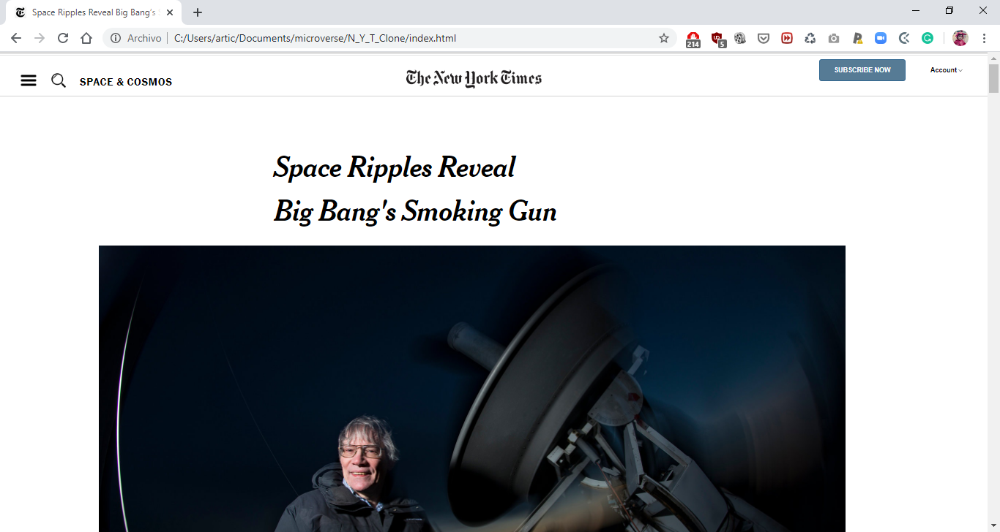

Project: Positioning and Floating Elements
Microverse 3rd project

# New_York_Times_Clone

About the project
This HTML/CSS project is the third on the Microverse course. The aim of the project is to make a clone of a newsletter webpage. 

The clone of the page contains a: 

-a lot of text

-video

-images

## Built With

- HTML,
- CSS

## Live Demo

[Live Demo Link](http://htmlpreview.github.io/?https://github.com/duducus/N_Y_T_Clone/blob/feature/index.html)

👤 **Author**

Jorge Cerón 
- Github: [@duducus](https://github.com/duducus)
- Twitter: [@jorge_ceron](https://twitter.com/ceronjorge1)
- Linkedin: [linkedin](https://www.linkedin.com/in/jorge-francisco-cer%C3%B3n-gil-343583113/)
- Google: jorge.ceron.gil@gmail.com

👤 **Author**

- Github: [@MindoJoseph](https://github.com/Mindo-Joseph)
- Twitter: [@mindoJoseph](https://twitter.com/mindoJoseph)
- Linkedin: [Joseph Mindo](https://www.linkedin.com/in/joseph-mindo-367284132/)
- Google: mindo.joseph.mj@gmail.com

## 🤝 Contributing

Contributions, issues and feature requests are welcome!

Feel free to check the [issues page](https://github.com/duducus/N_Y_T_Clone/issues).

## Show your support

Give a ⭐️ if you like this project!

